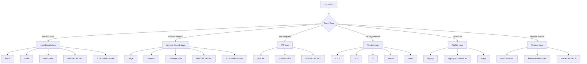
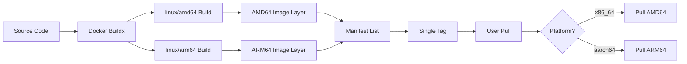
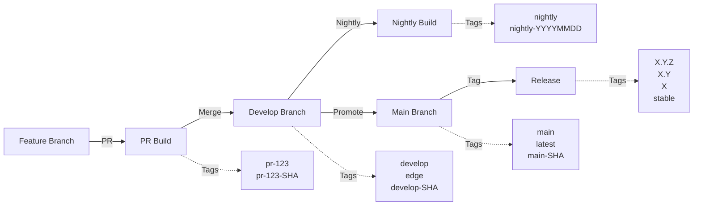
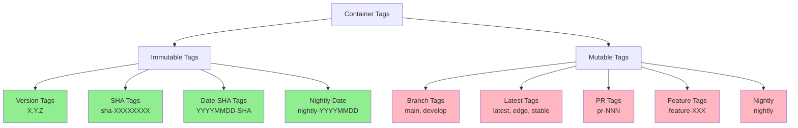
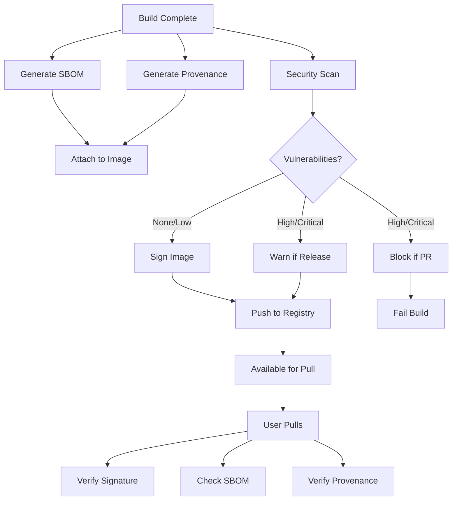
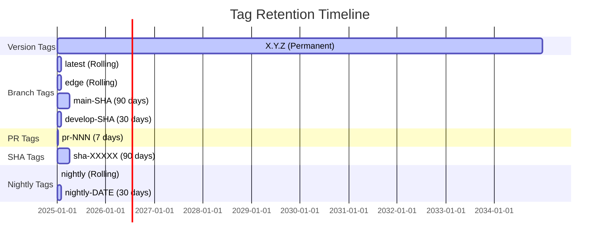
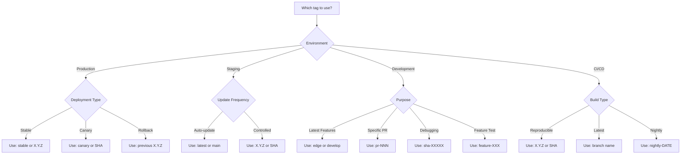

---
title: "Container Versioning Flow Diagram"
sidebar_label: "Versioning Diagram"
sidebar_position: 1
description: "Visual representation of container versioning and tag generation flow for PhotonDrift"
tags: ["containers", "versioning", "docker", "deployment"]
---

# Container Versioning Flow Diagram

## Tag Generation Flow

## Multi-Architecture Build Flow

## Version Promotion Flow

## Tag Immutability Matrix

## Security and Attestation Flow

## Tag Lifecycle Management

## Decision Tree for Tag Selection

