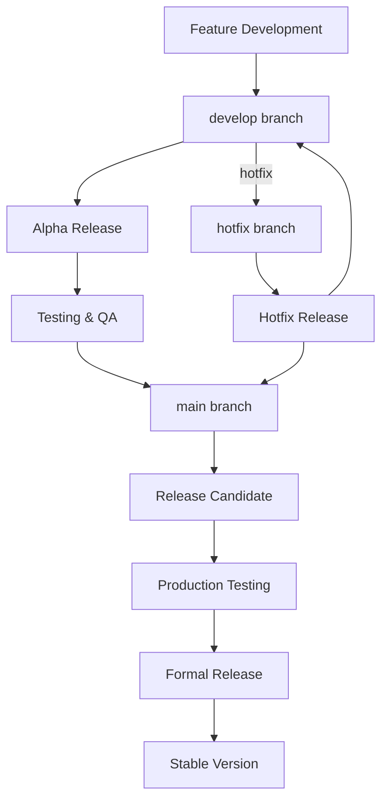

# PhotonDrift Versioning Strategy

## Overview

PhotonDrift implements a comprehensive semantic versioning strategy with branch-based automated releases. This system ensures consistent, predictable versioning across all build environments while maintaining clear separation between development, testing, and production releases.

## 🎯 Core Principles

### 1. Semantic Versioning (SemVer)
- **Format**: `MAJOR.MINOR.PATCH[-PRERELEASE][+BUILD]`
- **Example**: `0.3.0-alpha.20250728.a1b2c3d`
- **Compliance**: Follows [semver.org](https://semver.org) specification

### 2. Branch-Based Versioning
- **develop** → Alpha releases (`-alpha.YYYYMMDD.COMMIT`)
- **main** → Release candidates (`-rc.YYYYMMDD.COMMIT`)
- **release/** → Stable releases (no suffix)
- **hotfix/** → Hotfix releases (`-hotfix.YYYYMMDD.COMMIT`)

### 3. Automated Git Tagging
- All alpha and RC builds receive git tags automatically
- Tags include comprehensive metadata and build information
- Formal releases get permanent, immutable tags

## 📋 Version Types & Lifecycle



### Alpha Releases (`develop` branch)
- **Purpose**: Early development builds for testing new features
- **Format**: `X.Y.Z-alpha.YYYYMMDD.COMMIT`
- **Example**: `0.3.0-alpha.20250728.a1b2c3d`
- **Frequency**: Automatic on every push to `develop`
- **Stability**: Experimental - may contain bugs
- **Audience**: Developers, early testers

### Release Candidates (`main` branch)
- **Purpose**: Stable builds ready for production testing
- **Format**: `X.Y.Z-rc.YYYYMMDD.COMMIT`
- **Example**: `0.3.0-rc.20250728.b2c3d4e`
- **Frequency**: Automatic on every push to `main`
- **Stability**: High - feature-complete and tested
- **Audience**: QA teams, production testers

### Stable Releases (manual trigger)
- **Purpose**: Production-ready official releases
- **Format**: `X.Y.Z`
- **Example**: `0.3.0`, `1.0.0`, `2.1.3`
- **Frequency**: Manual via GitHub Actions workflow
- **Stability**: Maximum - thoroughly tested and verified
- **Audience**: End users, production deployments

### Hotfix Releases (`hotfix/*` branches)
- **Purpose**: Emergency fixes for critical issues
- **Format**: `X.Y.Z-hotfix.YYYYMMDD.COMMIT`
- **Example**: `0.3.1-hotfix.20250728.c3d4e5f`
- **Frequency**: As needed for critical issues
- **Stability**: Focused - minimal changes to fix specific issues
- **Audience**: Users affected by critical bugs

## 🛠️ Implementation Details

### Automated Versioning Script

The `scripts/semantic-version.sh` script handles all version generation:

```bash
# Generate version based on current branch
./scripts/semantic-version.sh patch          # Increment patch version
./scripts/semantic-version.sh minor          # Increment minor version  
./scripts/semantic-version.sh major          # Increment major version
./scripts/semantic-version.sh --force-tag    # Force create git tag
```

#### Version Generation Logic

```bash
# Branch-specific version patterns
case $branch in
    develop)
        echo "${new_base}-alpha.${TIMESTAMP}.${COMMIT_SHORT}"
        ;;
    main)
        echo "${new_base}-rc.${TIMESTAMP}.${COMMIT_SHORT}"
        ;;
    release/*)
        echo "${release_version}"  # From branch name
        ;;
    hotfix/*)
        echo "${hotfix_version}-hotfix.${TIMESTAMP}.${COMMIT_SHORT}"
        ;;
    *)
        echo "${new_base}-dev.${TIMESTAMP}.${COMMIT_SHORT}"
        ;;
esac
```

### GitHub Actions Integration

#### 1. Semantic Versioning Workflow (`.github/workflows/semantic-versioning.yml`)
- **Triggers**: Push to `develop` or `main`
- **Actions**: 
  - Generate appropriate version
  - Update `Cargo.toml`
  - Create git tag
  - Build binaries and WASM
  - Create GitHub release

#### 2. Formal Release Workflow (`.github/workflows/formal-release.yml`)
- **Trigger**: Manual workflow dispatch
- **Actions**:
  - Validate release prerequisites
  - Create release branch
  - Run comprehensive testing
  - Build production assets
  - Create formal GitHub release
  - Merge to main and sync branches

### Version Information Tracking

Each build generates a `version-info.json` file:

```json
{
  "version": "0.3.0-alpha.20250728.a1b2c3d",
  "branch": "develop",
  "commit": "a1b2c3d",
  "timestamp": "20250728",
  "build_date": "2025-07-28 14:30:45 UTC",
  "version_type": "alpha",
  "base_version": "0.3.0",
  "is_prerelease": true
}
```

## 🚀 Usage Guide

### For Developers

#### Creating Alpha Releases
```bash
# 1. Work on feature branch
git checkout -b feat/new-feature
# ... make changes ...

# 2. Merge to develop (triggers alpha build)
git checkout develop
git merge feat/new-feature
git push origin develop

# Result: 0.3.0-alpha.20250728.a1b2c3d created automatically
```

#### Promoting to Release Candidate
```bash
# 1. Merge develop to main (triggers RC build)
git checkout main
git merge develop
git push origin main

# Result: 0.3.0-rc.20250728.b2c3d4e created automatically
```

#### Creating Formal Releases
```bash
# Use GitHub Actions workflow dispatch:
# 1. Go to Actions → Formal Release Creation
# 2. Click "Run workflow"
# 3. Fill in:
#    - Release version: 0.3.0
#    - Source branch: main
#    - Release type: stable
# 4. Click "Run workflow"

# Result: v0.3.0 formal release created
```

### For Release Managers

#### Pre-Release Checklist
- [ ] All features merged to `develop`
- [ ] Alpha testing completed
- [ ] `develop` merged to `main`
- [ ] RC testing completed
- [ ] Documentation updated
- [ ] CHANGELOG.md prepared
- [ ] Release notes written

#### Release Process
1. **Trigger formal release workflow**
2. **Monitor build progress** (tests, builds, WASM)
3. **Verify release assets** (binaries, checksums)
4. **Validate release notes** and documentation
5. **Announce release** to community

### For CI/CD Integration

#### Environment Variables
```bash
# Available in GitHub Actions
GITHUB_REF_NAME=develop          # Branch name
GITHUB_SHA=a1b2c3d4e5f           # Full commit SHA
GITHUB_RUN_NUMBER=123            # Build number
```

#### Artifact Naming
```bash
# Alpha builds
photondrift-0.3.0-alpha.20250728.a1b2c3d-linux-amd64
photondrift-0.3.0-alpha.20250728.a1b2c3d.wasm

# RC builds  
photondrift-0.3.0-rc.20250728.b2c3d4e-linux-amd64
photondrift-0.3.0-rc.20250728.b2c3d4e.wasm

# Stable releases
photondrift-0.3.0-linux-amd64
photondrift-0.3.0.wasm
```

## 📊 Version Comparison Matrix

| Aspect | Alpha | RC | Stable | Hotfix |
|--------|-------|----|---------| -------|
| **Branch** | `develop` | `main` | `release/*` | `hotfix/*` |
| **Stability** | Low | High | Maximum | Focused |
| **Testing** | Basic | Comprehensive | Full | Targeted |
| **Frequency** | High | Medium | Low | As-needed |
| **Audience** | Developers | QA Teams | End Users | Critical Users |
| **Git Tag** | ✅ Auto | ✅ Auto | ✅ Manual | ✅ Auto |
| **GitHub Release** | ✅ Yes | ✅ Yes | ✅ Yes | ✅ Yes |
| **Breaking Changes** | ⚠️ Possible | ❌ No | ❌ No | ❌ No |

## 🔧 Configuration

### Branch Protection Rules
```yaml
# .github/branch-protection.yml
develop:
  required_status_checks: ["build", "test"]
  dismiss_stale_reviews: true
  require_code_owner_reviews: true

main:
  required_status_checks: ["build", "test", "security-scan"]
  dismiss_stale_reviews: true
  require_code_owner_reviews: true
  restrictions:
    users: ["release-manager"]
```

### Automated Version Bumping
```toml
# Cargo.toml version field updated automatically
[package]
version = "{GENERATED_VERSION}"  # Updated by CI/CD
```

### Release Asset Matrix
```yaml
# GitHub Actions matrix for multi-platform builds
strategy:
  matrix:
    include:
      - os: ubuntu-latest
        target: x86_64-unknown-linux-gnu
        asset: photondrift-linux-amd64
      - os: windows-latest  
        target: x86_64-pc-windows-msvc
        asset: photondrift-windows-amd64.exe
      - os: macos-latest
        target: x86_64-apple-darwin
        asset: photondrift-macos-amd64
      - os: ubuntu-latest
        target: wasm32-unknown-unknown
        asset: photondrift.wasm
```

## 🚨 Emergency Procedures

### Hotfix Release Process
```bash
# 1. Create hotfix branch from latest stable tag
git checkout -b hotfix/v0.3.1 v0.3.0

# 2. Apply minimal fix
git add .
git commit -m "fix: critical security vulnerability"

# 3. Push (triggers hotfix build)
git push origin hotfix/v0.3.1

# 4. Create emergency release
# Use formal release workflow with hotfix branch
```

### Rollback Procedures
```bash
# 1. Identify problematic release
git tag --list | grep v0.3

# 2. Create rollback release from previous stable
git checkout -b release/v0.3.0-rollback v0.2.9

# 3. Trigger formal release workflow
# Version: 0.3.0-rollback
# Type: emergency
```

## 📈 Metrics & Monitoring

### Version Tracking
- **GitHub Releases**: Comprehensive release history
- **Git Tags**: Immutable version markers  
- **Artifact Registry**: Build asset storage
- **Download Statistics**: Release adoption metrics

### Quality Gates
- **Test Coverage**: Must maintain >80%
- **Security Scan**: Zero critical vulnerabilities
- **Performance**: No regression >10%
- **Size Limits**: Binary <50MB, WASM <5MB

## 🎯 Future Enhancements

### Planned Features
- [ ] **LTS Releases**: Long-term support versions
- [ ] **Canary Releases**: Gradual rollout system
- [ ] **Semantic Analysis**: Automated breaking change detection
- [ ] **Release Health**: Automated rollback on issues
- [ ] **Custom Channels**: Enterprise release channels

### Integration Targets
- [ ] **Package Managers**: npm, cargo, homebrew
- [ ] **Container Registries**: Docker Hub, GitHub Packages
- [ ] **CDN Distribution**: jsDelivr, unpkg
- [ ] **Update Mechanisms**: In-app update notifications

---

## 📚 References

- [Semantic Versioning](https://semver.org/)
- [GitHub Flow](https://guides.github.com/introduction/flow/)
- [Git Tagging](https://git-scm.com/book/en/v2/Git-Basics-Tagging)
- [GitHub Actions](https://docs.github.com/en/actions)
- [Rust Release Process](https://forge.rust-lang.org/release/process.html)

---

*This versioning strategy ensures PhotonDrift maintains professional release standards while supporting rapid development cycles and emergency response capabilities.*