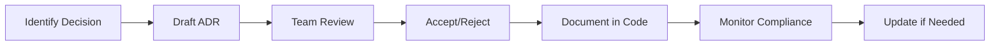

# ADRScan User Guide

> **Complete guide to using ADRScan for Architecture Decision Record management and drift detection**

## Table of Contents

1. [Quick Start](#quick-start)
2. [Installation](#installation)
3. [Core Commands](#core-commands)
4. [Configuration](#configuration)
5. [ADR Management](#adr-management)
6. [Drift Detection](#drift-detection)
7. [GitHub Integration](#github-integration)
8. [Best Practices](#best-practices)
9. [Troubleshooting](#troubleshooting)

## Quick Start

### 1. Install ADRScan

```bash
# Install from crates.io (coming soon)
cargo install adrscan

# Or build from source
git clone https://github.com/tbowman01/PhotonDrift.git
cd PhotonDrift
cargo build --release
```

### 2. Initialize Your Project

```bash
# Initialize ADR directory
adrscan init ./docs/adr

# Scan existing project
adrscan inventory

# Check for drift
adrscan diff

# Generate proposals for detected changes
adrscan propose
```

### 3. Set Up Automated Checking

Add to your `.github/workflows/main.yml`:

```yaml
- name: Check Architecture
  uses: tbowman01/PhotonDrift@main
  with:
    adr-directory: './docs/adr'
    fail-on-drift: true
```

## Installation

### From Crates.io (Recommended)

```bash
cargo install adrscan
```

### From GitHub Releases

```bash
# Download the latest release
curl -L https://github.com/tbowman01/PhotonDrift/releases/latest/download/adrscan-linux -o adrscan
chmod +x adrscan
sudo mv adrscan /usr/local/bin/
```

### From Source

```bash
git clone https://github.com/tbowman01/PhotonDrift.git
cd PhotonDrift
cargo build --release
# Binary will be in target/release/adrscan
```

### GitHub Action

The GitHub Action is available immediately:

```yaml
- uses: tbowman01/PhotonDrift@main
```

## Core Commands

### `adrscan init`

Initialize ADR structure in your project.

```bash
# Basic initialization
adrscan init

# Initialize in specific directory
adrscan init ./architecture/decisions

# Initialize with custom template
adrscan init --template custom --template-path ./templates/adr.md
```

**Creates:**
- ADR directory structure
- Initial ADR (0001-record-architecture-decisions.md)
- Configuration file (.adrscan.yaml)
- README with usage instructions

### `adrscan inventory`

Scan and catalog all existing ADRs.

```bash
# Basic inventory
adrscan inventory

# JSON output for automation
adrscan inventory --format json

# Filter by status
adrscan inventory --filter-status accepted

# Include full content
adrscan inventory --include-content
```

**Output:**
```
📋 ADR Inventory Report

Total ADRs: 15
├── ✅ Accepted: 12
├── 🔄 Proposed: 2
├── ❌ Rejected: 1
└── 📦 Superseded: 0

Recent ADRs:
├── 0015-microservices-architecture (2024-01-20) - Accepted
├── 0014-api-versioning-strategy (2024-01-18) - Accepted
└── 0013-database-sharding (2024-01-15) - Proposed
```

### `adrscan diff`

Detect architectural drift by comparing current state against ADRs.

```bash
# Basic drift detection
adrscan diff

# Compare against baseline snapshot
adrscan diff --baseline .adrscan-snapshot.json

# Save current state as new baseline
adrscan diff --save-snapshot .new-baseline.json

# JSON output for CI/CD
adrscan diff --format json
```

**Output:**
```
🔍 Drift Detection Results

Scan completed: 2,847 files analyzed
Baseline: .adrscan-snapshot.json (2024-01-15)

📊 Summary:
├── 🔴 Critical: 1
├── 🟠 High: 3  
├── 🟡 Medium: 8
└── 🟢 Low: 12

🚨 Critical Issues:
├── Rejected technology in use: MongoDB (src/database.ts:45)
└── Undocumented API breaking change (src/api/v2/users.ts)

⚠️ High Priority Issues:
├── New framework introduced: React Query (src/hooks/useData.ts)
├── Database schema change: users table (migrations/003_add_fields.sql)
└── Security pattern violation: Direct DB access (src/controllers/admin.ts)
```

### `adrscan propose`

Generate ADR proposals for detected drift.

```bash
# Generate proposals from latest drift
adrscan propose

# Use specific drift report
adrscan propose --drift-file drift-report.json

# Filter by severity
adrscan propose --severity critical,high

# Dry run (preview only)
adrscan propose --dry-run
```

**Output:**
```
📝 ADR Proposal Generation

Based on drift report: 24 items detected
Generating proposals for: 4 critical/high severity items

✅ Generated ADR proposals:
├── 0016-document-react-query-adoption.md
├── 0017-database-schema-evolution-strategy.md  
├── 0018-admin-access-security-model.md
└── 0019-mongodb-usage-decision.md

💡 Next steps:
1. Review generated proposals in ./docs/adr/
2. Customize content based on your decisions
3. Update status to 'accepted' when approved
```

### `adrscan index`

Generate or update an index of all ADRs.

```bash
# Generate default index
adrscan index

# Use custom template
adrscan index --template ./templates/index.md

# Specify output location  
adrscan index --output ./docs/DECISIONS.md
```

## Configuration

ADRScan uses `.adrscan.yaml` for configuration:

```yaml
# .adrscan.yaml
adr_dir: ./docs/adr
include_patterns:
  - "**/*.rs"
  - "**/*.ts" 
  - "**/*.js"
  - "**/Cargo.toml"
  - "**/package.json"
  - "**/docker-compose.yml"
exclude_patterns:
  - "**/node_modules/**"
  - "**/target/**"
  - "**/.git/**"
  - "**/build/**"
snapshot_file: ./.adrscan_snapshot.json
template:
  format: madr  # or 'custom'
  custom_path: ./templates/adr.md
drift:
  enabled: true
  detection_patterns:
    - name: "Database Technology"
      file_pattern: "**/*.{rs,ts,js,py}"
      content_pattern: "(mongodb|postgresql|mysql|redis)"
      category: "database"
    - name: "HTTP Framework"
      file_pattern: "**/Cargo.toml"
      content_pattern: "(axum|warp|actix|rocket)"
      category: "web-framework"
```

### Environment Variables

```bash
export ADRSCAN_LOG_LEVEL=debug    # Logging level
export ADRSCAN_CONFIG_PATH=./config/adrscan.yaml  # Custom config path
export ADRSCAN_ADR_DIR=./architecture/decisions   # ADR directory override
```

## ADR Management

### ADR Structure

ADRScan expects ADRs to follow this structure:

```
docs/adr/
├── README.md                          # Overview and index
├── 0001-record-architecture-decisions.md
├── 0002-choose-database-technology.md
├── 0003-api-design-principles.md
└── template.md                        # Template for new ADRs
```

### ADR Format

ADRScan supports MADR (Markdown Architecture Decision Records):

```markdown
---
title: Choose Database Technology
status: accepted
date: 2024-01-15
tags: [database, postgresql, performance]
supersedes: []
superseded_by: []
---

# Choose Database Technology

## Status
Accepted

## Context
We need to select a primary database technology for our application.
Key requirements:
- ACID compliance
- Strong consistency
- Good performance for read-heavy workloads
- Mature ecosystem

## Decision
We will use PostgreSQL as our primary database technology.

## Consequences
### Positive
- Battle-tested reliability
- Rich feature set (JSON, full-text search)  
- Strong community support
- Excellent tooling ecosystem

### Negative
- More complex setup than SQLite
- Higher resource requirements
- Need PostgreSQL expertise on team

## Implementation
- Use PostgreSQL 15+ for all new services
- Migrate existing MySQL databases during Q2
- Establish backup and monitoring procedures
```

### ADR Lifecycle

1. **Proposed** - Initial draft, under discussion
2. **Accepted** - Approved and being implemented  
3. **Rejected** - Decided against
4. **Superseded** - Replaced by newer decision

Update status in frontmatter:

```yaml
---
status: accepted  # proposed | accepted | rejected | superseded
---
```

## Drift Detection

### What Gets Detected

ADRScan identifies several types of architectural drift:

#### Technology Drift
- **New dependencies** not documented in ADRs
- **Rejected technologies** being used
- **Version changes** of critical dependencies

#### Structural Drift  
- **New architectural patterns** or styles
- **Package organization** changes
- **Module boundary** violations

#### Configuration Drift
- **Infrastructure** configuration changes
- **Build system** modifications  
- **Environment** setting updates

#### Pattern Drift
- **Design pattern** inconsistencies
- **Code organization** violations
- **Interface contract** changes

### Detection Patterns

Configure custom detection in `.adrscan.yaml`:

```yaml
drift:
  detection_patterns:
    - name: "Microservice Communication"
      file_pattern: "**/*.{rs,ts}"
      content_pattern: "(grpc|graphql|rest|kafka)"
      category: "communication"
      
    - name: "Authentication Method"
      file_pattern: "**/*.{rs,ts,js}"
      content_pattern: "(jwt|oauth|saml|basic)"
      category: "security"
      
    - name: "Container Technology"
      file_pattern: "**/Dockerfile*"
      content_pattern: "FROM\\s+(\\w+)"
      category: "infrastructure"
```

### Drift Severity Levels

- **🔴 Critical**: Violates accepted architectural decisions
- **🟠 High**: New technology without documentation
- **🟡 Medium**: Pattern inconsistencies or minor violations
- **🟢 Low**: Style or organizational issues

### Baseline Management

Create baselines to track changes over time:

```bash
# Create initial baseline
adrscan diff --save-snapshot baseline-v1.0.0.json

# Compare against baseline
adrscan diff --baseline baseline-v1.0.0.json

# Update baseline after approving changes
adrscan diff --save-snapshot baseline-v1.1.0.json
```

## GitHub Integration

### GitHub Action Setup

Basic setup in `.github/workflows/architecture.yml`:

```yaml
name: Architecture Compliance

on:
  pull_request:
  push:
    branches: [main]

jobs:
  architecture:
    runs-on: ubuntu-latest
    steps:
    - uses: actions/checkout@v4
    
    - name: Check Architecture
      uses: tbowman01/PhotonDrift@main
      with:
        adr-directory: './docs/adr'
        fail-on-drift: true
        create-issues: true
        github-token: ${{ secrets.GITHUB_TOKEN }}
```

### Automated Issue Creation

Enable automatic issue creation for detected drift:

```yaml
- uses: tbowman01/PhotonDrift@main
  with:
    create-issues: true
    severity-threshold: 'high'
    github-token: ${{ secrets.GITHUB_TOKEN }}
```

Issues are created with:
- **Structured titles**: `[High] Undocumented Redis Usage`
- **Detailed descriptions**: Context, location, recommendations
- **Appropriate labels**: `architectural-drift`, severity level
- **Action items**: Clear steps for resolution

### PR Comments

ADRScan automatically comments on PRs with drift summaries:

```markdown
## ⚠️ Architectural Drift Detected

ADRScan has detected potential architectural drift in this pull request.

**Summary:**
- 📊 Total drift items: **3**
- 🔴 Critical: **0**
- 🟠 High: **1**
- 🟡 Medium: **2**

### 🎯 Next Steps
1. Review the detected drift items
2. Update relevant ADRs if changes are intentional
3. Ensure architectural decisions are properly documented
```

## Best Practices

### 1. ADR Workflow



### 2. Drift Detection Strategy

- **Run on every PR** to catch drift early
- **Weekly scheduled scans** for continuous monitoring  
- **Baseline updates** with each release
- **Team notifications** for critical drift

### 3. Team Adoption

1. **Start small**: Begin with core architectural decisions
2. **Establish process**: Define who reviews/approves ADRs
3. **Automate checks**: Use GitHub Actions for enforcement
4. **Regular reviews**: Schedule architecture review meetings
5. **Tool training**: Ensure team knows how to use ADRScan

### 4. ADR Content Guidelines

**Good ADR:**
- Clear problem statement
- Considered alternatives
- Explicit decision with rationale
- Implementation guidance
- Consequences (positive and negative)

**Avoid:**
- Implementation details (belongs in code)
- Temporary decisions
- Obvious choices without alternatives
- Decisions that change frequently

## Troubleshooting

### Common Issues

#### ADRs Not Found
```
Error: No ADRs found in ./docs/adr
```
**Solution:**
```bash
# Initialize ADR directory
adrscan init ./docs/adr

# Or specify correct path
adrscan inventory --adr-dir ./architecture/decisions
```

#### Parse Errors
```
Warning: Failed to parse frontmatter in 0005-api-design.md
```
**Solution:**
```markdown
---
title: API Design Principles
status: accepted
date: 2024-01-15
---
# Rest of ADR content...
```

#### Performance Issues
```
Warning: Scan took 45 seconds (2847 files)
```
**Solution:**
```yaml
# Add exclusions to .adrscan.yaml
exclude_patterns:
  - "**/node_modules/**"
  - "**/target/**" 
  - "**/.git/**"
  - "**/build/**"
  - "**/dist/**"
```

#### GitHub Action Permissions
```
Error: Resource not accessible by integration
```
**Solution:**
```yaml
permissions:
  contents: read
  issues: write
  pull-requests: write
```

### Debug Mode

Enable detailed logging:

```bash
export RUST_LOG=debug
adrscan diff --format json
```

### Getting Help

- 📖 **Documentation**: [User Guide](/docs/user-guide)
- 🐛 **Bug Reports**: [GitHub Issues](https://github.com/tbowman01/PhotonDrift/issues)
- 💬 **Discussions**: [GitHub Discussions](https://github.com/tbowman01/PhotonDrift/discussions)
- 📧 **Contact**: Create an issue for support

### Version Compatibility

| ADRScan Version | Rust Version | Features |
|-----------------|--------------|----------|
| 0.1.x | 1.70+ | Core CLI commands |
| 0.2.x | 1.70+ | GitHub Action |
| 0.3.x (planned) | 1.70+ | WASM module |

---

## Next Steps

After reading this guide:

1. ✅ Install ADRScan
2. ✅ Initialize your first ADR
3. ✅ Set up automated checking
4. ✅ Create your team workflow
5. ✅ Start documenting decisions!

Happy architecture documentation! 🏗️