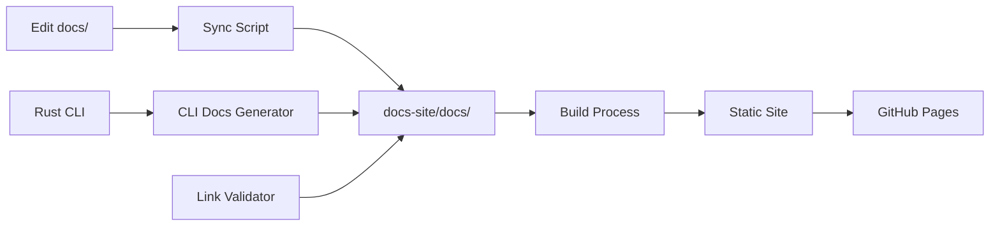

# PhotonDrift Development Guide

This document outlines the development approach and coordination for PhotonDrift ADRScan, including the comprehensive documentation system.

## Project Structure

```
PhotonDrift/
├── docs/                          # 📝 Source Documentation (edit here)
│   ├── getting-started/           # User guides and setup
│   ├── development/              # Contributing and development
│   ├── architecture/            # Technical architecture
│   ├── deployment/             # Deployment guides
│   ├── ml-features/           # AI/ML capabilities
│   ├── phase-planning/       # Project roadmaps
│   └── adr/                 # Architecture Decision Records
├── docs-site/                     # 🚀 Modern Documentation Site
│   ├── src/components/           # Custom React components
│   ├── static/                  # Static assets (images, etc.)
│   ├── docs/                   # Auto-generated from docs/
│   ├── scripts/               # Build automation
│   └── package.json          # Docusaurus configuration
├── scripts/                       # 🛠️ Build and Development Scripts
│   ├── build-docs.sh            # Full documentation build
│   └── dev-docs.sh              # Quick development workflow
├── .github/workflows/             # 🔄 CI/CD Automation
│   └── docs-deploy.yml          # Documentation deployment
├── src/                          # 🦀 Rust source code
├── Cargo.toml                    # Rust project manifest
└── README.md                     # Project overview
```

## 📚 Documentation Development Workflow

### Quick Start for Documentation Contributors

```bash
# 1. Setup (one-time)
./scripts/dev-docs.sh setup

# 2. Start development
./scripts/dev-docs.sh dev
# Visit http://localhost:3000

# 3. Edit files in docs/ directory
# 4. Sync changes
cd docs-site && npm run sync-docs
# Or: ./scripts/dev-docs.sh sync
```

### Documentation Architecture

PhotonDrift uses a modern **dual documentation system**:

1. **Source Files** (`docs/`): Standard Markdown files that contributors edit
2. **Generated Site** (`docs-site/`): Docusaurus v3 site with automation

#### Content Pipeline



#### Automated Features

- **Content Sync**: Automatic processing from `docs/` to `docs-site/docs/`
- **CLI Documentation**: Extracts help from Rust binary
- **Link Validation**: Checks internal and external links
- **Progressive Web App**: Offline support and mobile optimization
- **Auto-deployment**: GitHub Actions deploy to GitHub Pages

### Build Scripts

#### Full Documentation Build

```bash
# Complete build with all features
./scripts/build-docs.sh

# Options:
./scripts/build-docs.sh --clean --serve    # Clean build and serve
./scripts/build-docs.sh --fast             # Quick build for development
./scripts/build-docs.sh --no-validate      # Skip link validation
```

#### Development Workflow

```bash
# Setup development environment
./scripts/dev-docs.sh setup

# Start development server
./scripts/dev-docs.sh dev

# Sync content only
./scripts/dev-docs.sh sync

# Clean build artifacts
./scripts/dev-docs.sh clean
```

### Documentation Guidelines

#### File Organization

- **getting-started/**: User-facing guides, quickstart, CLI reference
- **development/**: Contributing guides, development setup
- **architecture/**: Technical architecture, system design
- **deployment/**: Docker, deployment, operations
- **ml-features/**: AI/ML capabilities and training
- **adr/**: Architecture Decision Records

#### Content Standards

**Frontmatter Example:**
```yaml
---
title: "Page Title"
sidebar_label: "Short Label"
sidebar_position: 1
description: "Brief description for SEO and navigation"
tags: ["relevant", "tags", "here"]
---
```

**Writing Guidelines:**
- Use clear, concise language
- Include practical code examples
- Link to related documentation
- Follow existing naming conventions
- Test all code examples

#### Interactive Components

The documentation site includes custom React components:

**CLI Command Examples:**
```markdown
import CliCommand from '@site/src/components/CliCommand';

<CliCommand
  command="adrscan diff --adr-dir ./docs/adr --directory ./src"
  description="Detect architectural drift with AI analysis"
  title="Drift Detection Example"
/>
```

**Feature Showcases:**
```markdown
import FeatureGrid from '@site/src/components/FeatureGrid';

<FeatureGrid features={CoreFeatures} columns={3} />
```

## Development Phases

### Phase 1: CLI MVP (4-6 weeks)
**Status**: 🏗️ In Progress  
**Focus**: Core Rust CLI with basic ADR management

**Critical Path Issues**:
1. **[#1 Rust Project Structure](https://github.com/tbowman01/PhotonDrift/issues/1)** - Foundation 
2. **[#3 Frontmatter Parsing](https://github.com/tbowman01/PhotonDrift/issues/3)** - Core parsing logic
3. **[#6 Configuration System](https://github.com/tbowman01/PhotonDrift/issues/6)** - Flexibility framework

**Parallel Development**:
- **[#2 Init Command](https://github.com/tbowman01/PhotonDrift/issues/2)** - Bootstrap functionality
- **[#4 Inventory Command](https://github.com/tbowman01/PhotonDrift/issues/4)** - Core scanning
- **[#5 Index Command](https://github.com/tbowman01/PhotonDrift/issues/5)** - Documentation generation

### Phase 2: Drift Detection (3-4 weeks)
**Status**: 📋 Planned  
**Focus**: Core drift detection and ADR proposal generation

**Dependencies**: Phase 1 completion  
**Key Issues**:
- **[#7 Drift Detection Engine](https://github.com/tbowman01/PhotonDrift/issues/7)** - Core algorithms
- **[#8 Diff Command](https://github.com/tbowman01/PhotonDrift/issues/8)** - User interface
- **[#9 Propose Command](https://github.com/tbowman01/PhotonDrift/issues/9)** - Auto-generation

### Phase 3: WASM & CI Integration (2-3 weeks)
**Status**: 🔧 Planned  
**Focus**: WebAssembly compilation and GitHub Action

**Dependencies**: Phase 2 completion  
**Key Issues**:
- **[#10 WebAssembly Module](https://github.com/tbowman01/PhotonDrift/issues/10)** - CI/CD integration
- **[#11 GitHub Action](https://github.com/tbowman01/PhotonDrift/issues/11)** - Automation

## Getting Started

### Prerequisites
- Rust 1.70+ with Cargo
- Git and GitHub CLI (`gh`)
- Basic familiarity with ADR concepts

### Development Workflow

1. **Pick an Issue**: Start with [Issue #1](https://github.com/tbowman01/PhotonDrift/issues/1) for foundation work
2. **Create Branch**: `git checkout -b feature/issue-N-description`
3. **Implement**: Follow acceptance criteria in the issue
4. **Test**: Include unit/integration tests
5. **Document**: Update relevant documentation
6. **Pull Request**: Link to the issue and describe changes

### Code Standards
- Follow Rust conventions and use `cargo fmt`
- Include comprehensive error handling
- Add unit tests for all public functions
- Document public APIs with rustdoc
- Use Clap for CLI argument parsing
- Support cross-platform operation (Linux, Windows, macOS)

## Testing Strategy

### Phase 1 Testing
- **Unit Tests**: Frontmatter parsing, file operations, command logic
- **Integration Tests**: End-to-end CLI workflows
- **Platform Tests**: Linux (primary), Windows, macOS (smoke tests)

### Phase 2 Testing  
- **Drift Detection**: Algorithm accuracy and performance
- **Large Repository**: Scalability testing
- **Edge Cases**: Malformed ADRs, missing files, permission issues

### Phase 3 Testing
- **WASM Compatibility**: Node.js and browser environments  
- **GitHub Action**: Real repository integration
- **API Parity**: CLI vs WASM output consistency

## Architecture Decisions

Key architectural decisions will be documented as ADRs in `docs/adr/` once the `init` command is implemented. This follows our own tool's conventions.

## Contributing

All development is coordinated through GitHub Issues. Each issue includes:
- Detailed acceptance criteria
- Priority and dependency information  
- Estimated effort and phase assignment
- Component and label categorization

See our [issue tracker](https://github.com/tbowman01/PhotonDrift/issues) for current tasks and priorities.