# 🏗️ Docusaurus Architecture Design for PhotonDrift

## 🎯 Architecture Overview

This document defines the comprehensive architecture for integrating Docusaurus v3 with PhotonDrift's documentation ecosystem, emphasizing modularity, automation, and scalability.

## 🏛️ High-Level System Architecture

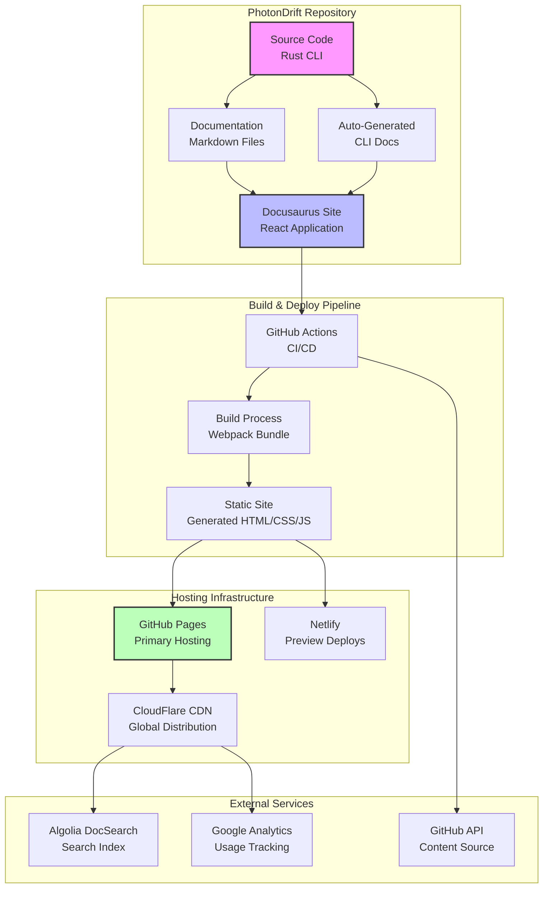

## 📁 Detailed Directory Architecture

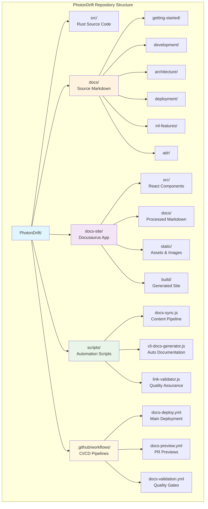

## 🔄 Content Processing Pipeline

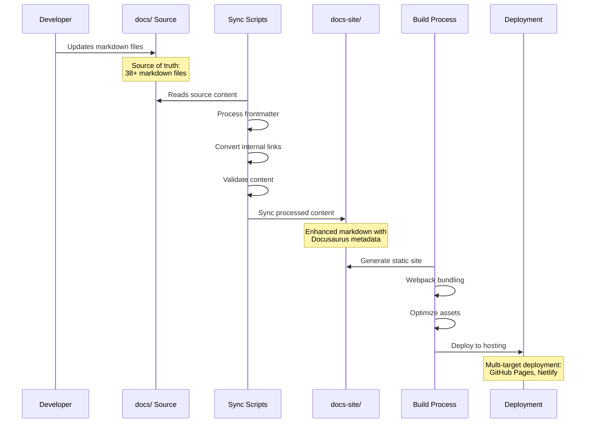

## 🧩 Component Architecture

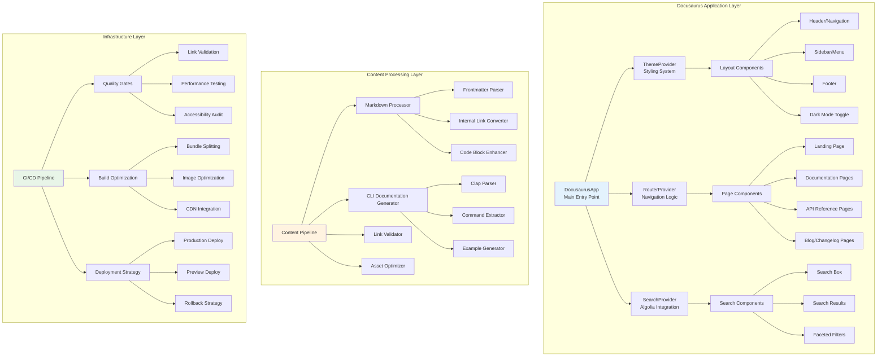

## 🔌 Integration Points & APIs

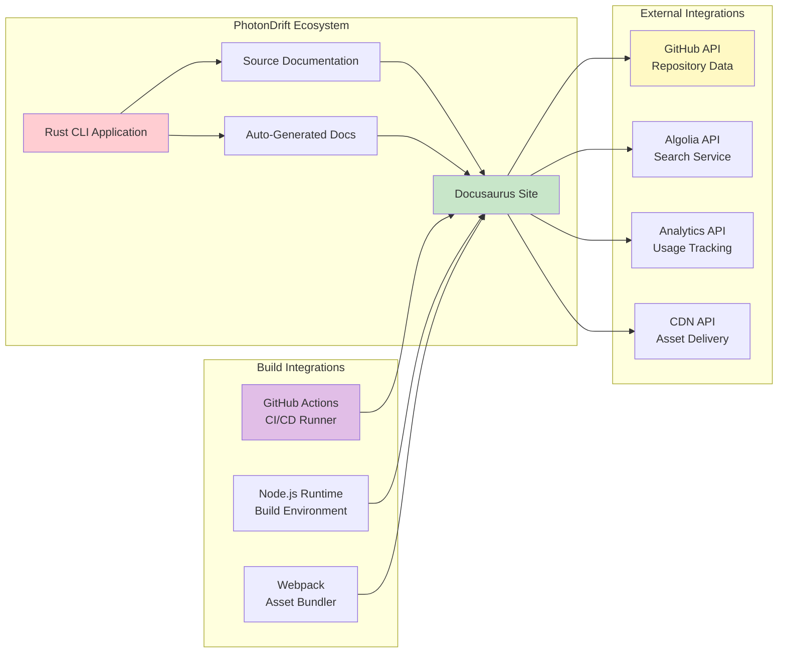

## 📊 Data Flow Architecture

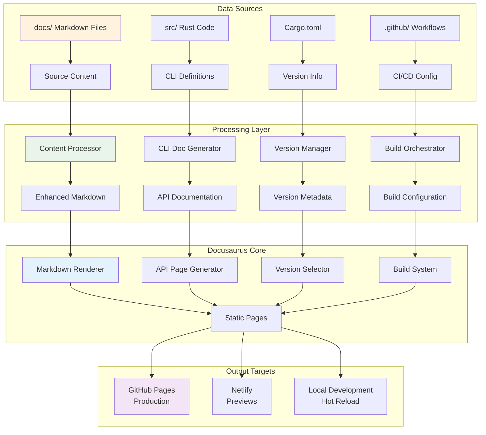

## 🏗️ Modular Architecture Design

### Core Modules

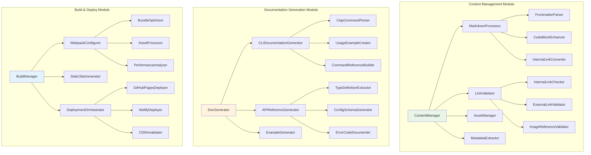

### Plugin Architecture

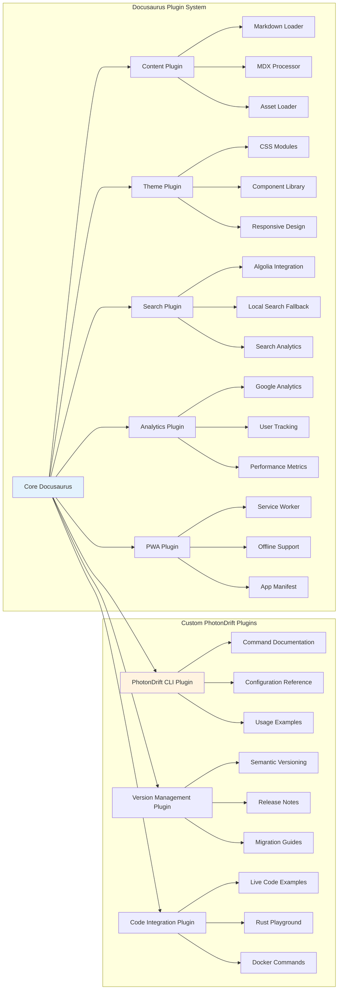

## 🔧 Configuration Architecture

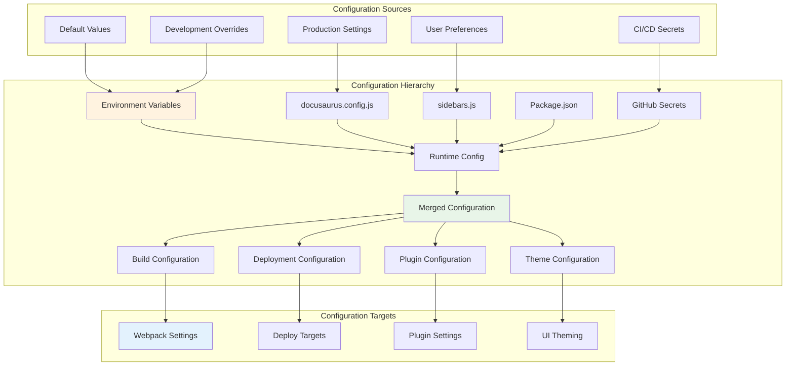

## 🚀 Deployment Architecture

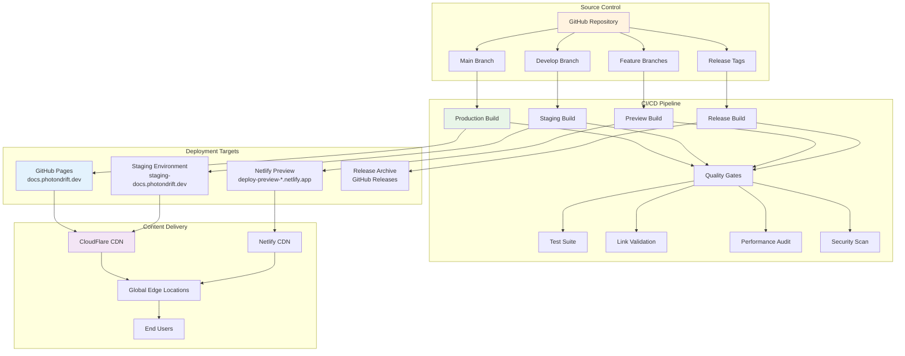

## 🔍 Search Architecture

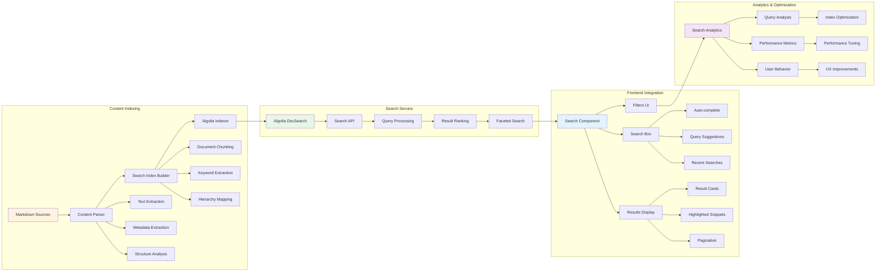

## 📱 Responsive Architecture

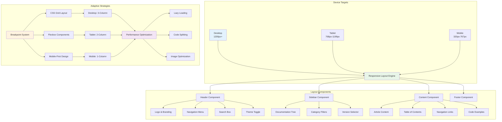

## 🔒 Security Architecture

```mermaid
graph TB
    subgraph "Content Security"
        A[Input Validation] --> B[Markdown Sanitization]
        B --> C[XSS Prevention]
        C --> D[Content Security Policy]
        
        A --> A1[Link Validation]
        A --> A2[File Type Restrictions]
        A --> A3[Size Limitations]
        
        D --> D1[Script-src Restrictions]
        D --> D2[Style-src Controls]
        D --> D3[Image-src Policies]
    end
    
    subgraph "Build Security"
        E[Dependency Scanning] --> F[Vulnerability Assessment]
        F --> G[Supply Chain Security]
        G --> H[Build Integrity]
        
        E --> E1[NPM Audit]
        E --> E2[Snyk Integration]
        E --> E3[GitHub Security Advisories]
        
        H --> H1[Checksum Verification]
        H --> H2[Signed Commits]
        H --> H3[Reproducible Builds]
    end
    
    subgraph "Deployment Security"
        I[HTTPS Enforcement] --> J[Certificate Management]
        J --> K[Access Controls]
        K --> L[Environment Isolation]
        
        I --> I1[TLS 1.3 Minimum]
        I --> I2[HSTS Headers]
        I --> I3[Certificate Pinning]
        
        L --> L1[Production Secrets]
        L --> L2[Staging Isolation]
        L --> L3[Development Sandboxing]
    end
    
    subgraph "Monitoring & Response"
        M[Security Monitoring] --> N[Threat Detection]
        N --> O[Incident Response]
        O --> P[Recovery Procedures]
        
        M --> M1[Access Logs]
        M --> M2[Anomaly Detection]
        M --> M3[Performance Monitoring]
        
        P --> P1[Rollback Procedures]
        P --> P2[Backup Restoration]
        P --> P3[Communication Protocols]
    end
    
    style A fill:#ffebee
    style E fill:#fff3e0
    style I fill:#e8f5e8
    style M fill:#e3f2fd
```

## 📊 Performance Architecture

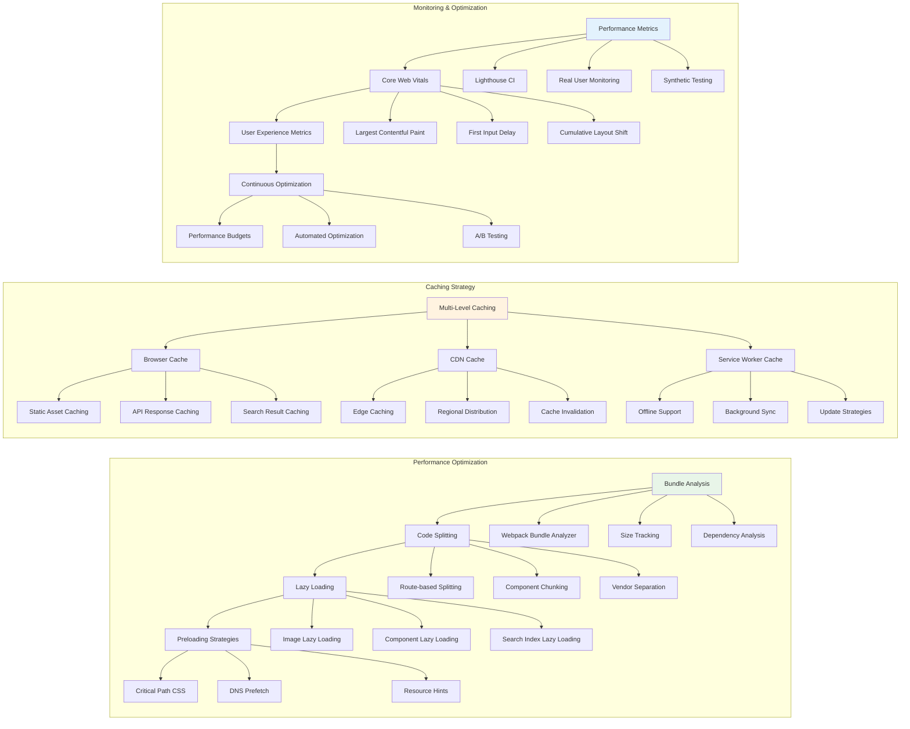

## 🔄 Version Management Architecture

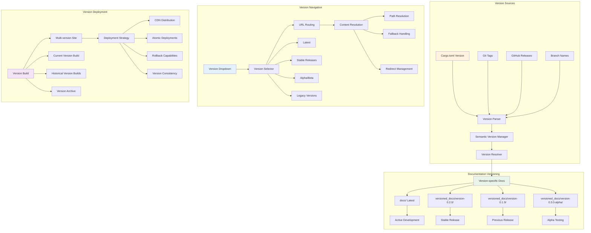

## 🧪 Testing Architecture

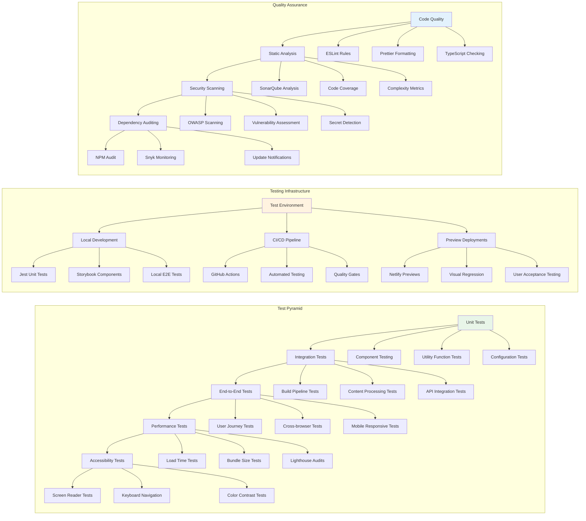

## 🚀 Implementation Roadmap

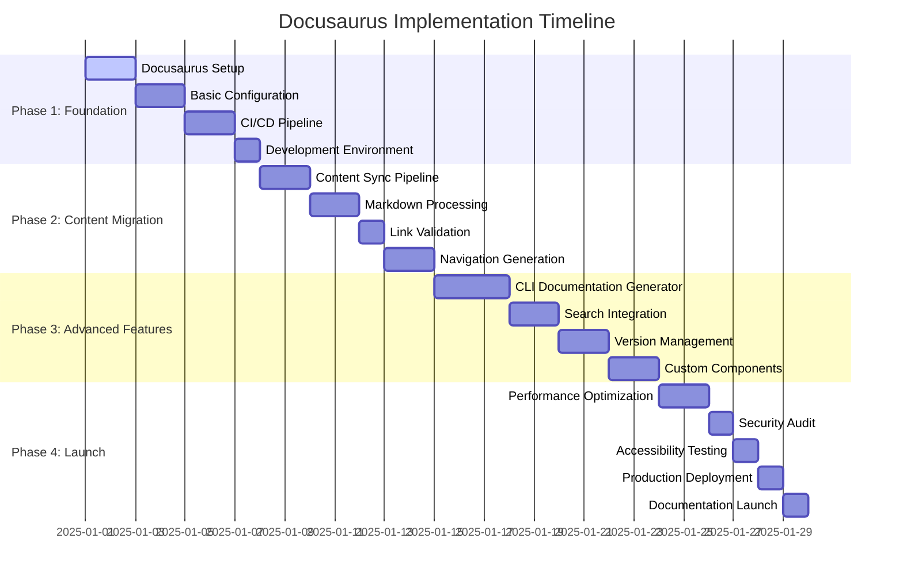

## 🎯 Success Metrics & KPIs

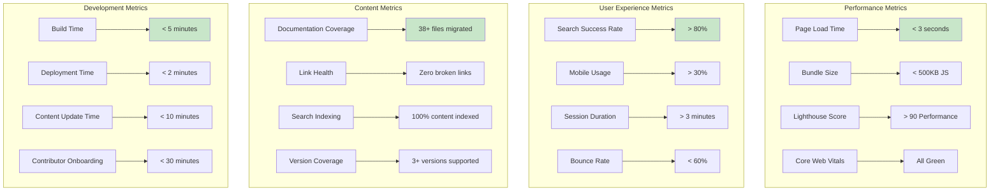

---

## 📋 Architecture Validation Checklist

### ✅ Modularity & Maintainability
- [ ] Clear separation of concerns between content, processing, and presentation
- [ ] Plugin-based architecture for extensibility
- [ ] Standardized configuration management
- [ ] Comprehensive error handling and logging

### ✅ Security & Compliance
- [ ] Input validation and sanitization
- [ ] Content Security Policy implementation
- [ ] HTTPS enforcement and security headers
- [ ] Dependency vulnerability scanning

### ✅ Performance & Scalability
- [ ] Bundle optimization and code splitting
- [ ] Multi-level caching strategy
- [ ] CDN integration and edge distribution
- [ ] Performance monitoring and budgets

### ✅ User Experience & Accessibility
- [ ] Mobile-first responsive design
- [ ] WCAG 2.1 AA compliance
- [ ] Comprehensive search functionality
- [ ] Intuitive navigation and information architecture

### ✅ Developer Experience
- [ ] Automated content synchronization
- [ ] Hot reload development environment
- [ ] Comprehensive testing coverage
- [ ] Clear documentation and contribution guidelines

---

*This architecture design provides a comprehensive blueprint for implementing Docusaurus with PhotonDrift, ensuring scalability, maintainability, and excellent user experience while preserving all existing documentation content.*